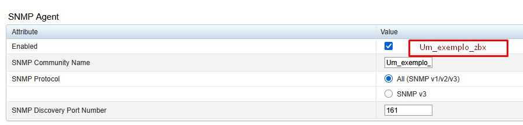
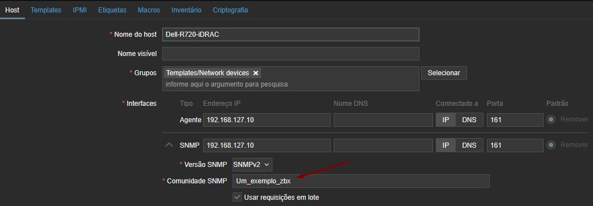

# Runbook – Monitoramento SNMP Dell R720 (iDRAC 7) com Zabbix 5

## Objetivo
Integrar o monitoramento de hardware do servidor Dell PowerEdge R720
via iDRAC 7 ao Zabbix 5 utilizando SNMP v2c.

---

## Pré-requisitos

- Acesso administrativo à iDRAC
- Acesso root ao Zabbix Server
- Comunicação UDP 161 liberada entre Zabbix Server e iDRAC
- Ferramentas SNMP instaladas (`net-snmp`)

---

## 1️⃣ Configuração do SNMP Agent na iDRAC 7

Caminho:
iDRAC Settings → Network → SNMP Agent
Configuração validada:



- Tela de configuração do SNMP Agent (como evidência)

---

## 2️⃣ Observação crítica sobre SNMP v1

A iDRAC 7 **não permite desabilitar SNMP v1 isoladamente**. \
Essa é uma limitação conhecida do firmware.

### Mitigação recomendada
- Restringir acesso UDP 161 **apenas ao IP do Zabbix Server**
- Utilizar community dedicada e não reutilizada
- Monitorar tráfego SNMP na rede de gerenciamento

---

## 3️⃣ Teste de conectividade SNMP (validação inicial)

No Zabbix Server, execute:

```bash
snmpwalk -v2c -c Um_exemplo_zbx 192.168.127.10 system
```
Resultado esperado
Retorno de informações como (Exemplo parcial do ambiente de produção):
```bash
SNMPv2-MIB::sysDescr
SNMPv2-MIB::sysObjectID
DISMAN-EVENT-MIB::sysUpTimeInstance
SNMPv2-MIB::sysContact
SNMPv2-MIB::sysName
SNMPv2-MIB::sysLocation
SNMPv2-MIB::sysORLastChange
SNMPv2-MIB::sysORID
SNMPv2-MIB::sysORDescr
SNMPv2-MIB::sysORUpTime
```
Erro já vivido:
```vbnet
Timeout: No Response from 192.168.127.10
```
Possíveis causas:
* Firewall bloqueando UDP 161
* IP incorreto
* Community diferente da configurada na iDRAC
* SNMP Agent não aplicado/salvo corretamente

## 4️⃣ Validação de conectividade de rede
```bash
ping 192.168.126.247
```
Teste de porta (UDP é stateless, mas ajuda):
```bash
nc -zu 192.168.127.10 161
```
## 5️⃣ Importação do template no Zabbix

No frontend:
```pgsql
Configuration → Templates → Import
```
Utilizar template compatível com:
Dell iDRAC 7
SNMP v2c
Zabbix 5

## 6️⃣ Cadastro do host no Zabbix
```pgsql
Configuration → Hosts → Create host
```


OBS.:
Na aba Templates: 
* Associar o template Dell importado \
Na parte `Comunidade SNMP` utilizar o mesmo parâmetro de `SNMP Community Name`

## 7️⃣ Validação no Zabbix
Itens esperados:
* Status geral do hardware 
* Temperaturas
* Fans
* Power Supplies
* Storage status

🔐 Boas práticas de segurança interna
Criar VLAN exclusiva para gerenciamento  
  * Restringir UDP 161 via firewall \
  * Não reutilizar community SNMP \
  * Registrar acessos SNMP no firewall \
  * Planejar migração futura para SNMP v3
